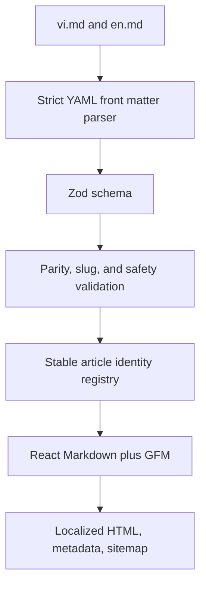

# Content flow

Each published article has an immutable `id`/`translationId` and one localized
slug per locale. The language switch resolves through that identity registry;
it never edits the URL text. Raw HTML, inline event handlers, JavaScript URLs,
duplicate localized slugs, and incomplete pairs fail validation.

Markdown is imported explicitly with Vite `?raw`, parsed at module load, and
rendered without `rehype-raw`. No runtime file scan or CMS call exists. Follow
the content publishing runbook before adding or changing a public article.
