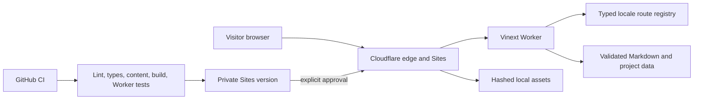

# Architecture overview

Junet.store V1 is a read-only content application compiled by Vinext into a
Cloudflare Worker-compatible Sites artifact. The Worker chooses the initial
locale, renders localized routes, and serves bundled assets. There is no
application origin, API, account, form, CMS, database, analytics, or remote
content dependency.

The core boundaries are:

- `app/`: HTTP routing, metadata, sitemap, robots, and localized layouts.
- `components/`: presentational and accessible interactive surfaces.
- `lib/`: route identities, locale negotiation, content contracts, SEO, facts.
- `content/`: ten repository-owned Markdown variants for five identities.
- `public/`: local images, icon, and the pre-hydration theme initializer.
- `worker/` and `build/`: Sites/Vinext runtime and packaging integration.

Graphify is durable cross-code/docs architecture evidence. GitNexus remains a
local symbol/impact index; `.gitnexus/` is never committed.
